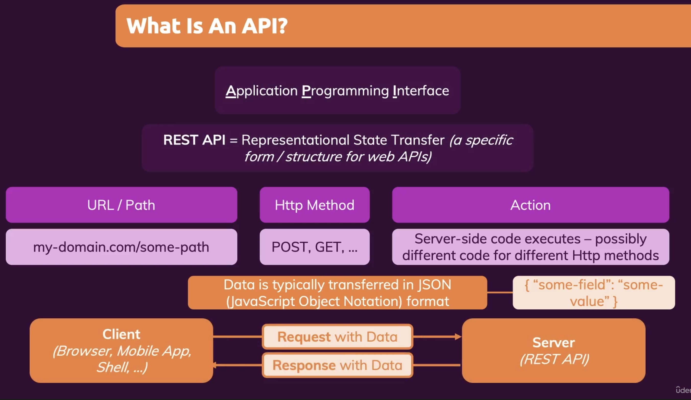
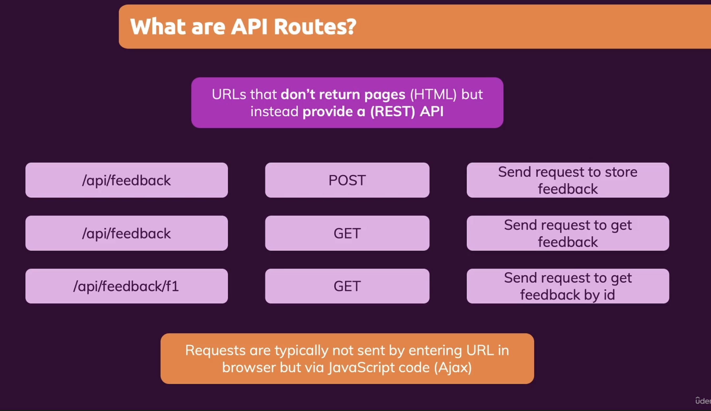

# Next.js


**The React Framework for Production**


## Pages & File-based Routing


### dynamic segments

```javascript

import { useRouter } from "next/router";

function PortfolioProjectPage() {
  const router = useRouter();

  console.log(router.pathname);
  
  // 
  console.log(router.query);

  // send a request to some backend server
  // to fetch the piece of data with an id of router.query.projectid

  return (
    <div>
      <h1>The Portfolio Project Page</h1>
    </div>
  );
}

export default PortfolioProjectPage;

```


### Navigation with links


```javascript

import Link from "next/link";

function ClientsPage() {
  const clients = [
    { id: "max", name: "Maximilian" },
    { id: "manu", name: "Manuel" },
  ];

  return (
    <div>
      <h1>The Clients Page</h1>
      <ul>
        {clients.map((client) => (
          <li key={client.id}>
            <Link href={`/clients/${client.id}`}>{client.name}</Link>
          </li>
        ))}
      </ul>
    </div>
  );
}

export default ClientsPage;

```


**Link href object**


```javascript

	<ul>
        {clients.map((client) => (
          <li key={client.id}>
            <Link
              href={{
                pathname: "/clients/[id]",
                query: { id: client.id },
              }}
            >
              {client.name}
            </Link>
          </li>
        ))}
	</ul>
```


### programmatic navigation


```javascript

import { useRouter } from 'next/router';

function ClientProjectsPage() {
  const router = useRouter();

  console.log(router.query);

  function loadProjectHandler() {
    
    router.push('/clients/max/projecta');
    
    // or
    // load data...
    router.push({
      pathname: '/clients/[id]/[clientprojectid]',
      query: { id: 'max', clientprojectid: 'projecta' },
    });
  }

  return (
    <div>
      <h1>The Projects of a Given Client</h1>
      <button onClick={loadProjectHandler}>Load Project A</button>
    </div>
  );
}

```


## Page Pre-Rendering & Data Fetching


**Two Froms of Pre-Rendering**

* **Static Generation**
* **Server-side Rendering**


### Static Generation


Pre-generate a page (with data prepared on the server-side) during build time

Pages are prepared ahead to time and can be cached by the server / SDN serving the app


**Incremental Static Generation**

Pre-generate page -> Re-generate it on every request, at most every X seconds


```javascript

import path from 'path';
import fs from 'fs/promises';

import Link from 'next/link';

function HomePage(props) {
  const { products } = props;

  return (
    <ul>
      {products.map((product) => (
        <li key={product.id}>
          <Link href={`/products/${product.id}`}>{product.title}</Link>
        </li>
      ))}
    </ul>
  );
}

export async function getStaticProps(context) {
  console.log('(Re-)Generating...');
  const filePath = path.join(process.cwd(), 'data', 'dummy-backend.json');
  const jsonData = await fs.readFile(filePath);
  const data = JSON.parse(jsonData);

  if (!data) {
    return {
      redirect: {
        destination: '/no-data',
      },
    };
  }

  if (data.products.length === 0) {
    return { notFound: true };
  }

  return {
    props: {
      products: data.products,
    },
    
    // Re-generate it on every request, at most every 10 seconds
    revalidate: 10,
  };
}

export default HomePage;

```


**Working with Dynamic Parameters**


```javascript

import path from 'path';
import fs from 'fs/promises';

import { Fragment } from 'react';

function ProductDetailPage(props) {
  const { loadedProduct } = props;

  if (!loadedProduct) {
    return <p>Loading...</p>;
  }

  return (
    <Fragment>
      <h1>{loadedProduct.title}</h1>
      <p>{loadedProduct.description}</p>
    </Fragment>
  );
}

async function getData() {
  const filePath = path.join(process.cwd(), 'data', 'dummy-backend.json');
  const jsonData = await fs.readFile(filePath);
  const data = JSON.parse(jsonData);

  return data;
}

export async function getStaticProps(context) {
  const { params } = context;

  const productId = params.pid;

  const data = await getData();

  const product = data.products.find((product) => product.id === productId);

  if (!product) {
    return { notFound: true };
  }

  return {
    props: {
      loadedProduct: product,
    },
  };
}

// Working with Dynamic Parameters has to add getStaticPaths()
export async function getStaticPaths() {
  const data = await getData();

  const ids = data.products.map((product) => product.id);
  const pathsWithParams = ids.map((id) => ({ params: { pid: id } }));

  return {
    paths: pathsWithParams,
    
    // if the pathsWithParams include all ids
    // fallback: false
    
    // next.js will not serve anything until we done generating this page
    // fallback: 'blocking'
    
    // does not have to pre define all possible params
    fallback: true,
  };
}

export default ProductDetailPage;

```


### Server Side Rendering


```javascript

function UserIdPage(props) {
  return <h1>{props.id}</h1>;
}

export default UserIdPage;

export async function getServerSideProps(context) {
  const { params } = context;

  const userId = params.uid;

  return {
    props: {
      id: 'userid-' + userId,
    },
  };
}

```


### Client Side Data Fetching


```javascript

import { useEffect, useState } from 'react';
import useSWR from 'swr';

function LastSalesPage(props) {
  const [sales, setSales] = useState(props.sales);
  // const [isLoading, setIsLoading] = useState(false);

  const { data, error } = useSWR(
    'https://nextjs-course-c81cc-default-rtdb.firebaseio.com/sales.json'
  );

  useEffect(() => {
    if (data) {
      const transformedSales = [];

      for (const key in data) {
        transformedSales.push({
          id: key,
          username: data[key].username,
          volume: data[key].volume,
        });
      }

      setSales(transformedSales);
    }
  }, [data]);

  // useEffect(() => {
  //   setIsLoading(true);
  //   fetch('https://nextjs-course-c81cc-default-rtdb.firebaseio.com/sales.json')
  //     .then((response) => response.json())
  //     .then((data) => {
  //       const transformedSales = [];

  //       for (const key in data) {
  //         transformedSales.push({
  //           id: key,
  //           username: data[key].username,
  //           volume: data[key].volume,
  //         });
  //       }

  //       setSales(transformedSales);
  //       setIsLoading(false);
  //     });
  // }, []);

  if (error) {
    return <p>Failed to load.</p>;
  }

  if (!data && !sales) {
    return <p>Loading...</p>;
  }

  return (
    <ul>
      {sales.map((sale) => (
        <li key={sale.id}>
          {sale.username} - ${sale.volume}
        </li>
      ))}
    </ul>
  );
}

// Combine Static Generation

export async function getStaticProps() {
  const response = await fetch(
    'https://nextjs-course-c81cc-default-rtdb.firebaseio.com/sales.json'
  );
  const data = await response.json();

  const transformedSales = [];

  for (const key in data) {
    transformedSales.push({
      id: key,
      username: data[key].username,
      volume: data[key].volume,
    });
  }

  return { props: { sales: transformedSales } };
}

export default LastSalesPage;

```


## Optimizing NextJS Apps


### Configuring the "head" Content

```javascript

import Head from 'next/head';

import { getFeaturedEvents } from '../helpers/api-util';
import EventList from '../components/events/event-list';

function HomePage(props) {
  return (
    <div>
      <Head>
        <title>NextJS Events</title>
        <meta
          name='description'
          content='Find a lot of great events that allow you to evolve...'
        />
      </Head>
      <EventList items={props.events} />
    </div>
  );
}

export async function getStaticProps() {
  const featuredEvents = await getFeaturedEvents();

  return {
    props: {
      events: featuredEvents,
    },
    revalidate: 1800,
  };
}

export default HomePage;

```


```javascript

import { Fragment, useEffect, useState } from 'react';
import { useRouter } from 'next/router';
import useSWR from 'swr';
import Head from 'next/head';

import { getFilteredEvents } from '../../helpers/api-util';
import EventList from '../../components/events/event-list';
import ResultsTitle from '../../components/events/results-title';
import Button from '../../components/ui/button';
import ErrorAlert from '../../components/ui/error-alert';

function FilteredEventsPage(props) {
  const [loadedEvents, setLoadedEvents] = useState();
  const router = useRouter();

  const filterData = router.query.slug;

  const { data, error } = useSWR(
    'https://nextjs-course-c81cc-default-rtdb.firebaseio.com/events.json'
  );

  useEffect(() => {
    if (data) {
      const events = [];

      for (const key in data) {
        events.push({
          id: key,
          ...data[key],
        });
      }

      setLoadedEvents(events);
    }
  }, [data]);

  let pageHeadData = (
    <Head>
      <title>Filtered Events</title>
      <meta name='description' content={`A list of filtered events.`} />
    </Head>
  );

  if (!loadedEvents) {
    return (
      <Fragment>
        {pageHeadData}
        <p className='center'>Loading...</p>
      </Fragment>
    );
  }

  const filteredYear = filterData[0];
  const filteredMonth = filterData[1];

  const numYear = +filteredYear;
  const numMonth = +filteredMonth;

  pageHeadData = (
    <Head>
      <title>Filtered Events</title>
      <meta
        name='description'
        content={`All events for ${numMonth}/${numYear}.`}
      />
    </Head>
  );

  if (
    isNaN(numYear) ||
    isNaN(numMonth) ||
    numYear > 2030 ||
    numYear < 2021 ||
    numMonth < 1 ||
    numMonth > 12 ||
    error
  ) {
    return (
      <Fragment>
        {pageHeadData}
        <ErrorAlert>
          <p>Invalid filter. Please adjust your values!</p>
        </ErrorAlert>
        <div className='center'>
          <Button link='/events'>Show All Events</Button>
        </div>
      </Fragment>
    );
  }

  const filteredEvents = loadedEvents.filter((event) => {
    const eventDate = new Date(event.date);
    return (
      eventDate.getFullYear() === numYear &&
      eventDate.getMonth() === numMonth - 1
    );
  });

  if (!filteredEvents || filteredEvents.length === 0) {
    return (
      <Fragment>
        {pageHeadData}
        <ErrorAlert>
          <p>No events found for the chosen filter!</p>
        </ErrorAlert>
        <div className='center'>
          <Button link='/events'>Show All Events</Button>
        </div>
      </Fragment>
    );
  }

  const date = new Date(numYear, numMonth - 1);

  return (
    <Fragment>
      {pageHeadData}
      <ResultsTitle date={date} />
      <EventList items={filteredEvents} />
    </Fragment>
  );
}

export default FilteredEventsPage;

```


```javascript

import Head from 'next/head';

import Layout from '../components/layout/layout';
import '../styles/globals.css';

function MyApp({ Component, pageProps }) {
  return (
    <Layout>
      <Head>
        <title>Next Events</title>
        <meta name='description' content='NextJS Events' />
        <meta name='viewport' content='initial-scale=1.0, width=device-width' />
      </Head>
      <Component {...pageProps} />
    </Layout>
  );
}

export default MyApp;

```


### Add "Document"

```javascript

import Document, { Html, Head, Main, NextScript } from 'next/document';

class MyDocument extends Document {
  render() {
    return (
      <Html lang='en'>
        <Head />
        <body>
          <div id='overlays' />
          <Main />
          <NextScript />
        </body>
      </Html>
    );
  }
}

export default MyDocument;

```


### Optimising Images with the "Next Image" 


```javascript

import Image from 'next/image';


<div className={classes.image}>
        <Image src={`/${image}`} alt={imageAlt} width={400} height={400} />
</div>
      
```


https://nextjs.org/docs/api-reference/next/image


## API Routes








`pages/index.js`

```javascript

import { useRef, useState } from 'react';

function HomePage() {
  const [feedbackItems, setFeedbackItems] = useState([]);

  const emailInputRef = useRef();
  const feedbackInputRef = useRef();

  function submitFormHandler(event) {
    event.preventDefault();

    const enteredEmail = emailInputRef.current.value;
    const enteredFeedback = feedbackInputRef.current.value;

    const reqBody = { email: enteredEmail, text: enteredFeedback };

    fetch('/api/feedback', {
      method: 'POST',
      body: JSON.stringify(reqBody),
      headers: {
        'Content-Type': 'application/json',
      },
    })
      .then((response) => response.json())
      .then((data) => console.log(data));
  }

  function loadFeedbackHandler() {
    fetch('/api/feedback')
      .then((response) => response.json())
      .then((data) => {
        setFeedbackItems(data.feedback);
      });
  }

  return (
    <div>
      <h1>The Home Page</h1>
      <form onSubmit={submitFormHandler}>
        <div>
          <label htmlFor='email'>Your Email Address</label>
          <input type='email' id='email' ref={emailInputRef} />
        </div>
        <div>
          <label htmlFor='feedback'>Your Feedback</label>
          <textarea id='feedback' rows='5' ref={feedbackInputRef}></textarea>
        </div>
        <button>Send Feedback</button>
      </form>
      <hr />
      <button onClick={loadFeedbackHandler}>Load Feedback</button>
      <ul>
        {feedbackItems.map((item) => (
          <li key={item.id}>{item.text}</li>
        ))}
      </ul>
    </div>
  );
}

export default HomePage;

```


`/pages/feedback/index.js`

```javascript

import { Fragment, useState } from 'react';

import { buildFeedbackPath, extractFeedback } from '../api/feedback/index';

function FeedbackPage(props) {
  const [feedbackData, setFeedbackData] = useState();

  function loadFeedbackHandler(id) {
    fetch(`/api/feedback/${id}`)
      .then((response) => response.json())
      .then((data) => {
        setFeedbackData(data.feedback);
      }); // /api/some-feedback-id
  }

  return (
    <Fragment>
      {feedbackData && <p>{feedbackData.email}</p>}
      <ul>
        {props.feedbackItems.map((item) => (
          <li key={item.id}>
            {item.text}{' '}
            <button onClick={loadFeedbackHandler.bind(null, item.id)}>
              Show Details
            </button>
          </li>
        ))}
      </ul>
    </Fragment>
  );
}

export async function getStaticProps() {
  
  // directly call api backend functions
  const filePath = buildFeedbackPath();
  const data = extractFeedback(filePath);
  return {
    props: {
      feedbackItems: data,
    },
  };
}

export default FeedbackPage;

```


`pages/api/feedback/index.js`


```javascript

import fs from 'fs';
import path from 'path';

export function buildFeedbackPath() {
  return path.join(process.cwd(), 'data', 'feedback.json');
}

export function extractFeedback(filePath) {
  const fileData = fs.readFileSync(filePath);
  const data = JSON.parse(fileData);
  return data;
}

function handler(req, res) {
  if (req.method === 'POST') {
    const email = req.body.email;
    const feedbackText = req.body.text;

    const newFeedback = {
      id: new Date().toISOString(),
      email: email,
      text: feedbackText,
    };

    // store that in a database or in a file
    const filePath = buildFeedbackPath();
    const data = extractFeedback(filePath);
    data.push(newFeedback);
    fs.writeFileSync(filePath, JSON.stringify(data));
    res.status(201).json({ message: 'Success!', feedback: newFeedback });
  } else {
    const filePath = buildFeedbackPath();
    const data = extractFeedback(filePath);
    res.status(200).json({ feedback: data });
  }
}

export default handler;

```


`pages/api/feedback/[feedbackId].js `


```javascript

import { buildFeedbackPath, extractFeedback } from '.';

function handler(req, res) {
  const feedbackId = req.query.feedbackId;
  const filePath = buildFeedbackPath();
  const feedbackData = extractFeedback(filePath);
  const selectedFeedback = feedbackData.find(
    (feedback) => feedback.id === feedbackId
  );
  res.status(200).json({ feedback: selectedFeedback });
}

export default handler;

```


