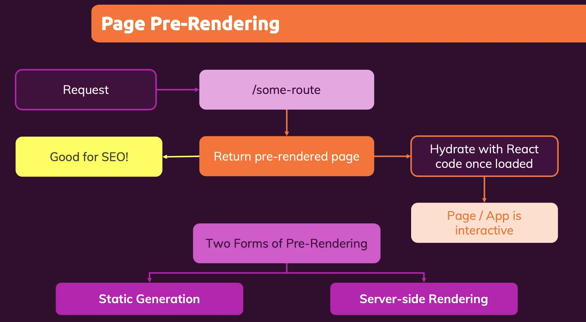
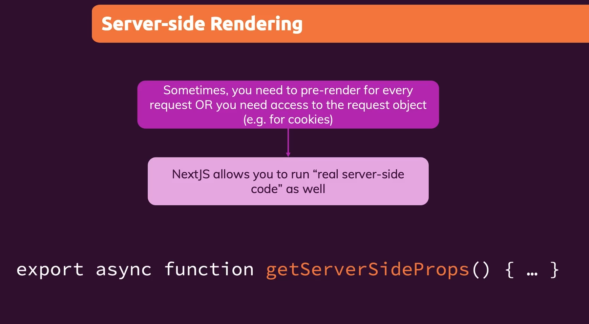
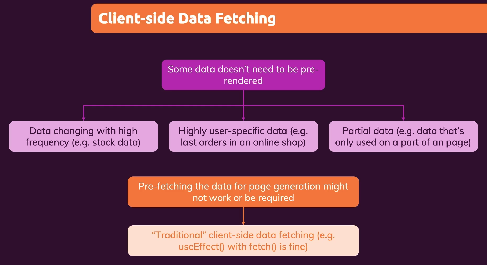

# Next.js


**The React Framework for Production**


## Pages & File-based Routing


### dynamic segments

```javascript

import { useRouter } from "next/router";

function PortfolioProjectPage() {
  const router = useRouter();

  console.log(router.pathname);
  
  // 
  console.log(router.query);

  // send a request to some backend server
  // to fetch the piece of data with an id of router.query.projectid

  return (
    <div>
      <h1>The Portfolio Project Page</h1>
    </div>
  );
}

export default PortfolioProjectPage;

```


### Navigation with links


```javascript

import Link from "next/link";

function ClientsPage() {
  const clients = [
    { id: "max", name: "Maximilian" },
    { id: "manu", name: "Manuel" },
  ];

  return (
    <div>
      <h1>The Clients Page</h1>
      <ul>
        {clients.map((client) => (
          <li key={client.id}>
            <Link href={`/clients/${client.id}`}>{client.name}</Link>
          </li>
        ))}
      </ul>
    </div>
  );
}

export default ClientsPage;

```


**Link href object**


```javascript

	<ul>
        {clients.map((client) => (
          <li key={client.id}>
            <Link
              href={{
                pathname: "/clients/[id]",
                query: { id: client.id },
              }}
            >
              {client.name}
            </Link>
          </li>
        ))}
	</ul>
```


### programmatic navigation


```javascript

import { useRouter } from 'next/router';

function ClientProjectsPage() {
  const router = useRouter();

  console.log(router.query);

  function loadProjectHandler() {
    
    router.push('/clients/max/projecta');
    
    // or
    // load data...
    router.push({
      pathname: '/clients/[id]/[clientprojectid]',
      query: { id: 'max', clientprojectid: 'projecta' },
    });
  }

  return (
    <div>
      <h1>The Projects of a Given Client</h1>
      <button onClick={loadProjectHandler}>Load Project A</button>
    </div>
  );
}

```


## Page Pre-Rendering & Data Fetching




**Two Froms of Pre-Rendering**

* **Static Generation**
* **Server-side Rendering**


### Static Generation


Pre-generate a page (with data prepared on the server-side) during build time

Pages are prepared ahead to time and can be cached by the server / SDN serving the app


**Incremental Static Generation**

Pre-generate page -> Re-generate it on every request, at most every X seconds


```javascript

import path from 'path';
import fs from 'fs/promises';

import Link from 'next/link';

function HomePage(props) {
  const { products } = props;

  return (
    <ul>
      {products.map((product) => (
        <li key={product.id}>
          <Link href={`/products/${product.id}`}>{product.title}</Link>
        </li>
      ))}
    </ul>
  );
}

export async function getStaticProps(context) {
  console.log('(Re-)Generating...');
  const filePath = path.join(process.cwd(), 'data', 'dummy-backend.json');
  const jsonData = await fs.readFile(filePath);
  const data = JSON.parse(jsonData);

  if (!data) {
    return {
      redirect: {
        destination: '/no-data',
      },
    };
  }

  if (data.products.length === 0) {
    return { notFound: true };
  }

  return {
    props: {
      products: data.products,
    },
    
    // Re-generate it on every request, at most every 10 seconds
    revalidate: 10,
  };
}

export default HomePage;

```


**Working with Dynamic Parameters**


```javascript

import path from 'path';
import fs from 'fs/promises';

import { Fragment } from 'react';

function ProductDetailPage(props) {
  const { loadedProduct } = props;

  if (!loadedProduct) {
    return <p>Loading...</p>;
  }

  return (
    <Fragment>
      <h1>{loadedProduct.title}</h1>
      <p>{loadedProduct.description}</p>
    </Fragment>
  );
}

async function getData() {
  const filePath = path.join(process.cwd(), 'data', 'dummy-backend.json');
  const jsonData = await fs.readFile(filePath);
  const data = JSON.parse(jsonData);

  return data;
}

export async function getStaticProps(context) {
  const { params } = context;

  const productId = params.pid;

  const data = await getData();

  const product = data.products.find((product) => product.id === productId);

  if (!product) {
    return { notFound: true };
  }

  return {
    props: {
      loadedProduct: product,
    },
  };
}

// Working with Dynamic Parameters has to add getStaticPaths()
export async function getStaticPaths() {
  const data = await getData();

  const ids = data.products.map((product) => product.id);
  const pathsWithParams = ids.map((id) => ({ params: { pid: id } }));

  return {
    paths: pathsWithParams,
    // does not have to pre define all possible params
    fallback: true,
  };
}

export default ProductDetailPage;

```


### Server Side Rendering





```javascript

function UserIdPage(props) {
  return <h1>{props.id}</h1>;
}

export default UserIdPage;

export async function getServerSideProps(context) {
  const { params } = context;

  const userId = params.uid;

  return {
    props: {
      id: 'userid-' + userId,
    },
  };
}

```


### Client Side Data Fetching





```javascript

import { useEffect, useState } from 'react';
import useSWR from 'swr';

function LastSalesPage(props) {
  const [sales, setSales] = useState(props.sales);
  // const [isLoading, setIsLoading] = useState(false);

  const { data, error } = useSWR(
    'https://nextjs-course-c81cc-default-rtdb.firebaseio.com/sales.json'
  );

  useEffect(() => {
    if (data) {
      const transformedSales = [];

      for (const key in data) {
        transformedSales.push({
          id: key,
          username: data[key].username,
          volume: data[key].volume,
        });
      }

      setSales(transformedSales);
    }
  }, [data]);

  // useEffect(() => {
  //   setIsLoading(true);
  //   fetch('https://nextjs-course-c81cc-default-rtdb.firebaseio.com/sales.json')
  //     .then((response) => response.json())
  //     .then((data) => {
  //       const transformedSales = [];

  //       for (const key in data) {
  //         transformedSales.push({
  //           id: key,
  //           username: data[key].username,
  //           volume: data[key].volume,
  //         });
  //       }

  //       setSales(transformedSales);
  //       setIsLoading(false);
  //     });
  // }, []);

  if (error) {
    return <p>Failed to load.</p>;
  }

  if (!data && !sales) {
    return <p>Loading...</p>;
  }

  return (
    <ul>
      {sales.map((sale) => (
        <li key={sale.id}>
          {sale.username} - ${sale.volume}
        </li>
      ))}
    </ul>
  );
}

// Combine Static Generation

export async function getStaticProps() {
  const response = await fetch(
    'https://nextjs-course-c81cc-default-rtdb.firebaseio.com/sales.json'
  );
  const data = await response.json();

  const transformedSales = [];

  for (const key in data) {
    transformedSales.push({
      id: key,
      username: data[key].username,
      volume: data[key].volume,
    });
  }

  return { props: { sales: transformedSales } };
}

export default LastSalesPage;

```


